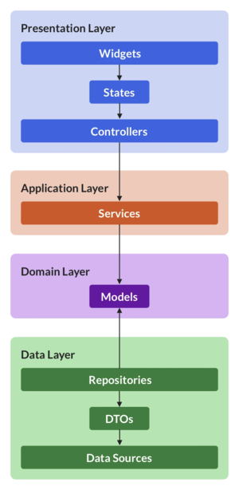

# impostor

Impostor game.

## Getting Started

**In a feature-first DDD architecture, with a separation of concerns for domain,
data, infrastructure, and presentation,
the file structure for the GameSettings feature might look like this:

```text
|-- game_settings/
|   |-- model/ (with freezed)
|   |   |-- game_settings.dart
|   |-- data/
|   |   |-- game_settings_provider.dart
|   |   |-- game_settings_repository.dart
|   |-- service/ (services has repos as dependencies)
|   |   |-- game_settings_service.dart
|   |-- widgets/
|-- game_settings_page_controller.dart
|-- game_settings_page.dart
```

## Internationalization

### Adding a new pair of words

Word pairs (wp) are set in the en-GB.arb file.

1. Add the wp_WORD_A_WORD_B: to all languages files.
2. Register the const_dictionary.dart file as a string.
3. Finally, add the constant string to dictionary.codegen.dart file.

## Features



## Development errors hints

### Error: Bad state: Future already completed

This happens when we switch on another widget.

```dart
  Future<void> createParty() async {
  state = const AsyncValue.loading();
  state = await AsyncValue.guard(
    ref
        .read(partyServiceProvider)
        .createParty,
  );
}
```

To solve this issue, use the mounted property.

```dart
  Future<void> createParty() async {
  state = const AsyncValue.loading();
  final newState = await AsyncValue.guard(
    ref
        .read(partyServiceProvider)
        .createParty,
  );

  if (mounted) {
    state = newState;
  }
}
```

## Add local storage with Hive

1. Create a constant string in `const_strings.dart` file.
2. Initialize the Hive box in the `bootstrap.dart` file.
3. Add the provider in the `hive_provider.codegen.dart` file.
4. Generate the code with:

```bash
dart run build_runner watch
```

## Deploy

First build the flutter web app.

```bash
flutter build web --release --no-tree-shake-icons
```

Then, deploy the app to firebase hosting.

```bash
firebase deploy
```

Deploy only the Firebase Rules

```bash
firebase deploy --only firestore:rules
```

To list all hosted channels

```bash
firebase hosting:channels:list
```

To delete a channel

```bash
firebase hosting:channel:delete <channel_id>
```

## Generate launcher icons

Package
used: [flutter_launcher_icons](https://pub.dev/packages/flutter_launcher_icons).

The `flutter_launcher_icons.yaml` file is located in the root of the project.

```bash
dart run flutter_launcher_icons 
```
